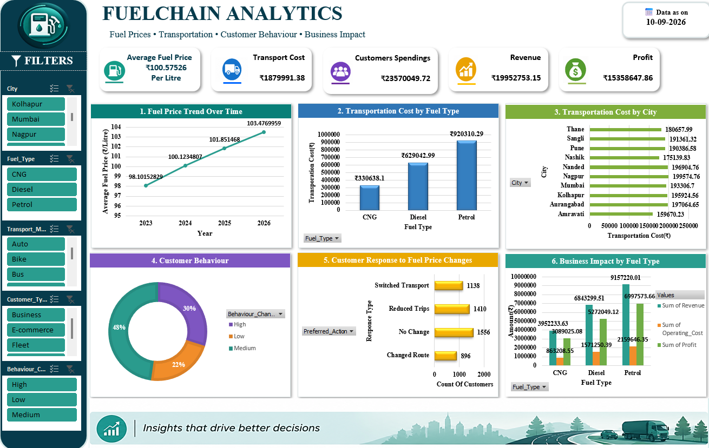

# Fuel-Chain-Analytics

Interactive Excel dashboard for analyzing fuel prices, transportation costs, customer behaviour, and business impact.

## Dashboard Preview

## Key Features

- Fuel Price Analysis
- Transportation Cost Analysis
- Customer Behaviour Analysis
- Customer Response to Fuel Price Changes
- Business Impact Analysis
- Interactive Excel Filters and Slicers
